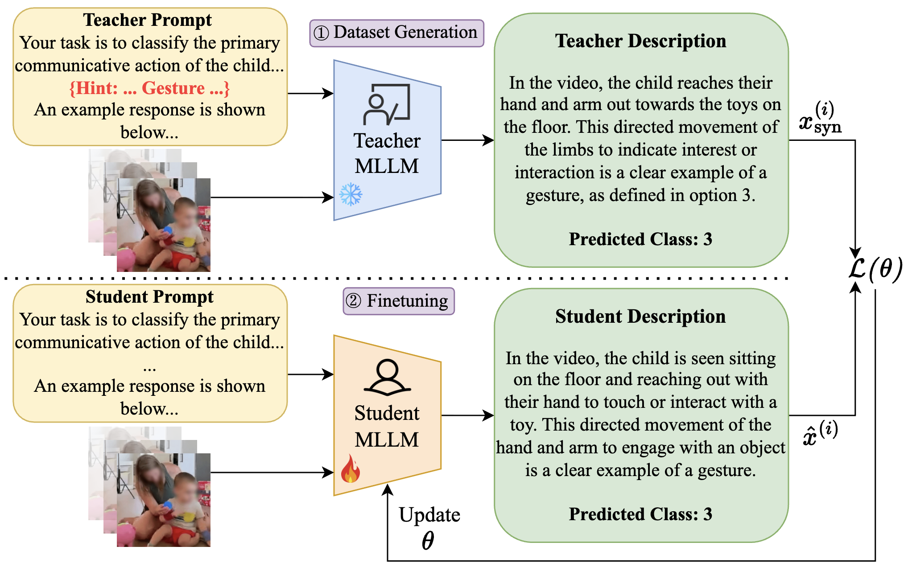

<h1 font-size:40px align="center">ROSCO-Omni: Multimodal LLM-Based Communication Understanding for Non- and Minimally-Speaking Autistic Individuals</h2>
<h3 font-size:40px align="center">Siddhant Bikram Shah and Kristina T. Johnson</h3>

  

This is the code repository for our paper **ROSCO-Omni: Multimodal LLM-Based Communication Understanding** published at ACL Findings 2026. 
